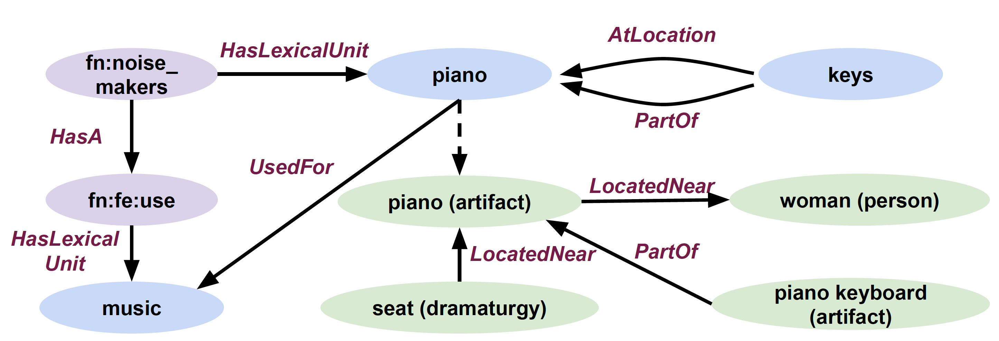

# Representation

CSKG is modeled as a **hyper-relational graph**. It describes edges in a tabular format, following the KGTK [data model](https://kgtk.readthedocs.io/en/latest/data_model/) and [file specification](https://kgtk.readthedocs.io/en/latest/specification/).

## CSKG columns

The edges in CSKG are described by ten columns, which can be grouped into three groups:
* Following KGTK, the primary information about an edge consists of its `id`, `node1`, `relation`, and `node2` (**default edge columns**). 
* Next, we include four **lifted edge columns**, using KGTK's abbreviated way of representing triples about the primary elements, such as `node1;label` or `relation;label` (label of `node1` and of `relation`). 
* Each edge is completed by two qualifiers (**secondary edges**): `source`, which specifies the source(s) of the edge (e.g., "CN" for ConceptNet), and `sentence`, containing the linguistic lexicalization of a triple, if given by the original source. 

Summarizing, here are the 10 columns that comprise the CSKG edge representation: 

1. `id` is an edge identifier, constructed by concatenating its node1, relation, and node2 elements. We aim to have edge ids be consistent across CSKG versions.
2. `node1` is a node identifier, must have a single value, cannot be empty, cannot have empty spaces. 
3. `relation` is an identifier, must have a single value from a predefined list, cannot be empty, cannot have empty spaces.
4. `node2` is a node identifier, must have a single value, cannot be empty, cannot have empty spaces. 
5. `node1;label` is a textual label for `node1`. It can have multiple different values, separated with a "|" character. Can be empty.
6. `node2;label` is a textual label for `node2`. It can have multiple different values, separated with a "|" character. Can be empty.
7. `relation;label` is a textual label for `relation`. It can have multiple different values, separated with a "|" character. Can be empty.
8. `relation;dimension` is an abstract knowledge type for a relation (e.g., "spatial"), one of the predefined 13 categories in [this paper](https://arxiv.org/abs/2101.04640). Can have multiple values. Can be empty.
9. `source` is a list of the source KGs in which this edge was found (e.g., ConceptNet). Can have multiple values, separated by "|". Can be empty.
10. `sentence` is the original sentence from which the triple was derived. Can have multiple values, separated by "|" (in case we have multiple sources). Can be empty.

## Example

Let's start with a simplified Figure of CSKG that talks about playing piano:



Here are the set of edges in CSKG that correspond to the Figure:
```
id	node1	relation	node2	node1;label	node2;label	relation;label	relation;dimension	source	sentence
fn:noise_makers-/r/HasA-fn:fe:use-0000	fn:noise_makers	/r/HasA	fn:fe:use	noise makers	use	/r/has a	part-whole	FN	
fn:noise_makers-fn:HasLexicalUnit-fn:lu:noise_makers:piano-0000	fn:noise_makers	fn:HasLexicalUnit	fn:lu:noise_makers:piano	noise makers	piano	has lexical unit	lexical	FN	
fn:fe:use-fn:HasLexicalUnit-/c/en/music	fn:fe:use	fn:HasLexicalUnit	/c/en/music				lexical	FNC	
/c/en/piano-/r/UsedFor-/c/en/music-0000	/c/en/piano	/r/UsedFor	/c/en/music	piano	music	used for	utility	CN	[[a piano]] is for [[music]]
/c/en/keys-/r/AtLocation-/c/en/piano-0000	/c/en/keys	/r/AtLocation	/c/en/piano	keys	piano	at location	spatial	CN	*Something you find on [[a piano]] is [[keys]]
/c/en/piano_keyboard/n/wn/artifact-/r/PartOf-/c/en/clavier/n/wn/artifact-0000	/c/en/piano_keyboard/n/wn/artifact	/r/PartOf	/c/en/clavier/n/wn/artifact	clavier|fingerboard|piano keyboard	forte-piano|piano|pianoforte	is a part of|part of	part-whole	CN|WN	[[piano keyboard]] is a part of [[piano]]
/c/en/clavier/n/wn/artifact-/r/LocatedNear-/c/en/woman/n/wn/person-0000	/c/en/clavier/n/wn/artifact	/r/LocatedNear	/c/en/woman/n/wn/person	piano	woman	near	spatial	VG	
/c/en/seat/n/wn/dramaturgy-/r/LocatedNear-/c/en/clavier/n/wn/artifact-0000	/c/en/seat/n/wn/dramaturgy	/r/LocatedNear	/c/en/clavier/n/wn/artifact	seat	piano	for	spatial	VG	
```

The first two edges, stating that pianos can be a noise maker and that noise makers have a use, are from FrameNet (`FN`). The third edge, stating that this use is for music comes from our `FNC` mapping between FrameNet and ConceptNet. ConceptNet (`CN`) itself tells us that keys are parts of a piano, located at a piano, and that pianos are used for music. Next, WordNet and ConceptNet (`CN|WN`) tell us that piano keyboards are parts of pianos. Finally, Visual Genome (`VG`) informs us that seats may be located near pianos and pianos near women.

## Auxiliary files

CSKG is mainly described with a single tabular file. Auxiliary KGTK files can be added to describe additional knowledge about some edges, such as their weight, through the corresponding edge `id`s. 
